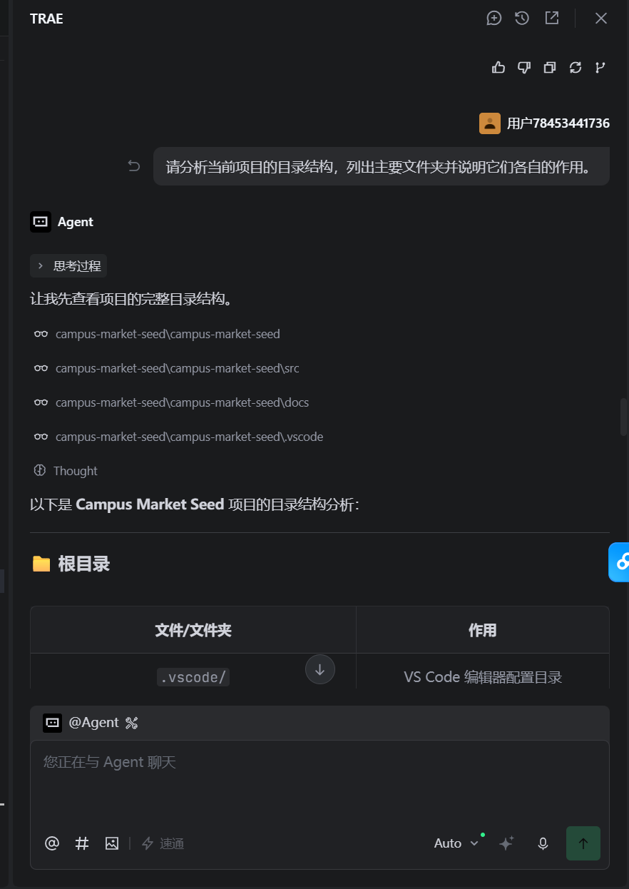
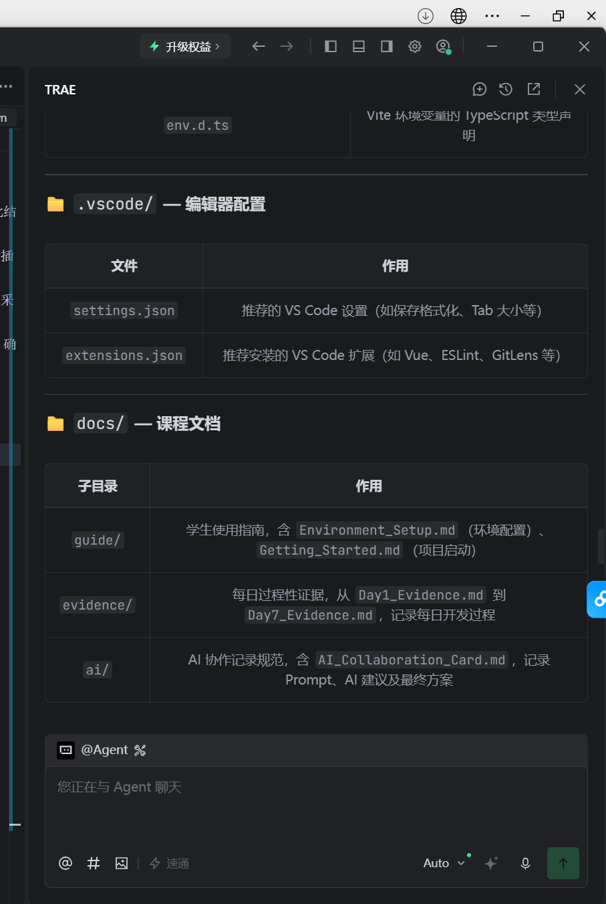
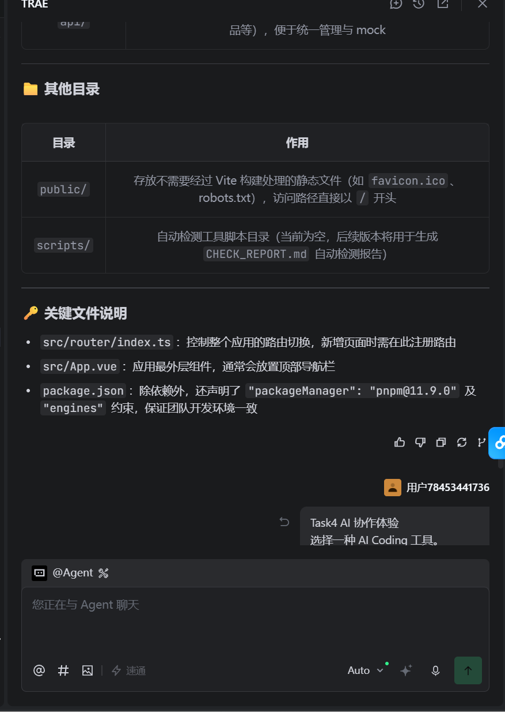

AI Collaboration Card

### Task 4 · AI 协作体验

> AI 工具：**Trae**
> 日期：2026-06-27
> 目标：让 AI 分析项目结构与技术栈，建立对项目的整体理解

### 一、Prompt 1 · 分析项目目录结构
Prompt：请分析当前项目的目录结构，列出主要文件夹并说明它们各自的作用。

AI 输出：

📁 根目录
├── .vscode/           VS Code 编辑器配置（settings.json、extensions.json）
├── docs/              课程文档
│   ├── guide/         环境配置与项目启动指南
│   ├── evidence/      Day1~Day7 的每日过程性证据模板
│   └── ai/            AI 协作记录规范
├── public/            静态资源（favicon.ico 等，原样复制到构建产物）
├── scripts/           自动检测脚本（当前为空，后续启用）
└── src/               项目源代码（核心目录）
    ├── main.ts        应用入口，初始化 Vue / Pinia / Router
    ├── App.vue        根组件，包含全局布局与 <RouterView/>
    ├── views/         页面级组件（当前仅 HomeView.vue）
    ├── router/        路由配置，定义 URL 与页面的映射
    ├── stores/        Pinia 全局状态管理（用户、购物车等）
    ├── components/    可复用组件（商品卡片、导航栏等）
    └── api/           后端接口请求封装（登录、商品列表等）

根目录的关键配置文件：
- .editorconfig  统一编辑器缩进与编码格式
- .gitignore     Git 忽略文件清单
- .nvmrc         Node.js 版本约束（当前为 25.9.0）
- .oxlintrc.json Oxlint 代码检查规则
- eslint.config.ts  ESLint 代码质量检查配置
- vite.config.ts  Vite 构建工具配置（含 @ 路径别名）
- tsconfig.json  TypeScript 编译配置
- package.json   项目依赖与包管理声明（pnpm@11.9.0）

自己的理解：

AI 的分析基本准确。`src/` 下的 6 个目录各司其职，遵循「关注点分离」原则：
- `views/` 放页面级组件（粒度大，一个路由对应一个 View）
- `components/` 放可复用组件（粒度小，被多个 View 调用）
- `router/` 控制路由切换
- `stores/` 管理跨页面共享状态
- `api/` 统一管理 HTTP 请求，便于 mock 与替换

`docs/` 与 `scripts/` 是课程专用目录，不影响应用本身功能，仅服务于过程性评价与自动检测。

最终结论：

目录结构清晰且符合 Vue 3 官方推荐的工程化约定。后续开发新增页面时应在 `views/` 创建 View、在 `router/` 注册路由、共用 UI 组件放到 `components/`、全局状态写进 `stores/`、接口请求封装到 `api/`。

### 二、Prompt 2 · 解释 main.ts

Prompt：请解释 src/main.ts 的作用，并逐行分析其代码含义。

AI 输出：
src/main.ts 是 Vue 3 应用的启动入口，作用是「组装应用并挂载到 DOM」。

代码分析：

1. import { createApp } from 'vue'
   从 vue 包中导入 createApp 工厂函数，用于创建一个新的 Vue 应用实例。

2. import { createPinia } from 'pinia'
   导入 Pinia 的 createPinia 工厂函数，Pinia 是 Vue 3 官方推荐的状态管理方案。

3. import App from './App.vue'
   导入根组件 App.vue，它是整个应用组件树的最顶层。

4. import router from './router'
   导入路由实例（由 src/router/index.ts 导出），用于管理页面切换与 URL 路由。

5. const app = createApp(App)
   创建应用实例。这一步仅实例化，尚未挂载到页面。

6. app.use(createPinia())
   将 Pinia 状态管理插件注册到应用中，使所有组件都能通过 useStore() 访问状态。

7. app.use(router)
   将路由插件注册到应用中，使 <RouterView/> 和 <RouterLink/> 等组件生效。

8. app.mount('#app')
   将应用挂载到 index.html 中 id="app" 的 DOM 元素上，此时页面才真正开始渲染。

执行顺序是「创建实例 → 安装插件 → 挂载到 DOM」，这是 Vue 3 标准的启动流程。

自己的理解：

AI 的解释非常清楚。`main.ts` 的工作流程是三步：
1. 用 `createApp(App)` 产生应用实例；
2. 依次 `use()` 安装 Pinia 和 Router；
3. `mount('#app')` 把组件树挂到真实 DOM 上。

这三步的顺序很重要：必须先装插件再 `mount`，否则插件内的生命周期钩子无法触发。后续如果引入 Element Plus、i18n 等插件，也应该写在 `mount` 之前、用 `app.use(xxx)` 方式注册。

最终结论：

`main.ts` 是整个应用的「启动脚本」，负责装配插件与挂载 DOM。后续如需新增全局插件（如 UI 组件库、国际化、Axios 等），均应在此文件中 `app.use()` 注册。

### 三、Prompt 3 · 解释 router 的作用

Prompt：请分析 src/router/index.ts 的内容，并说明 Vue Router 在本项目中的作用。

AI 输出：

当前 src/router/index.ts 的内容如下（精简后）：

  import { createRouter, createWebHistory } from 'vue-router'
  import HomeView from '@/views/HomeView.vue'

  const router = createRouter({
    history: createWebHistory(import.meta.env.BASE_URL),
    routes: [
      { path: '/', name: 'home', component: HomeView }
    ]
  })

  export default router

核心概念解释：

1. createRouter  —— 创建路由实例的工厂函数
2. createWebHistory —— 使用 HTML5 History 模式（URL 形如 /login 而非 /#/login），
   需要后端配合将所有路径回退到 index.html；开发环境 Vite 默认已支持
3. routes        —— 路由表，是「路径 → 组件」的映射清单
4. path          —— 浏览器 URL，例如 '/' 代表根路径
5. name          —— 路由别名，可在编程式导航中使用 router.push({ name: 'home' })
6. component     —— 该路径应渲染的页面组件（此处为 HomeView.vue）
7. <RouterView/> —— 在 App.vue 中作为「路由视图出口」，根据当前 URL 渲染对应组件
8. @ 路径别名    —— 在 vite.config.ts 中配置，指向 ./src，使 import 路径更简洁

Vue Router 在本项目中的作用：
- 让用户在「单页应用 SPA」中体验多页面切换（无需刷新浏览器）
- 把 URL 映射到具体 View，保证刷新、收藏、分享链接都能正确访问
- 提供编程式导航（router.push）与声明式导航（<RouterLink>）两种跳转方式
- 后续新增页面（登录、商品列表、发布、个人中心等）都只需在 routes 数组中追加一条记录

自己的理解：

AI 对 Router 的解释很到位。Vue Router 的本质是「让 URL 和 UI 保持同步」——用户输入哪个 URL，就渲染哪个 View；代码里调用 `router.push` 跳转也会同步更新浏览器地址栏。

当前路由表只有 1 条（`/` → `HomeView`），后续开发至少需要新增：
- `/login` → 登录页
- `/products` → 商品列表
- `/product/:id` → 商品详情
- `/publish` → 发布商品
- `/profile` → 个人中心

为了优化首屏性能，后续应把 `component: HomeView` 改写成 `component: () => import('@/views/xxx.vue')`（路由懒加载），这样只在用户访问时才加载对应页面的 JS。

最终结论：

Router 是整个应用的「页面导航中枢」。后续每新增一个页面，都要在 `routes` 数组中追加一条配置，并且配合 App.vue 中的 `<RouterView/>` 才能真正展示出来。推荐使用路由懒加载以提升首屏速度。

### 四、Prompt 4 · 分析当前项目采用的技术栈

Prompt：请分析本项目 package.json 以及各配置文件，梳理出当前项目采用的完整技术栈，并说明每个技术的作用。

AI 输出：

根据 package.json 和各配置文件，本项目的技术栈如下：

【框架与语言】
- Vue 3 (vue)              前端框架，组合式 API + SFC 单文件组件
- TypeScript (typescript)  为 JavaScript 添加静态类型，减少运行时错误
- vue-tsc                  Vue 官方 TypeScript 编译检查工具

【工程化与构建】
- Vite (vite)              新一代前端构建工具，开发服务器秒级启动、HMR 热更新
- @vitejs/plugin-vue       Vite 的 Vue SFC 支持插件
- vite-plugin-vue-devtools Vue DevTools 集成（组件树、状态、路由可视化调试）

【路由与状态管理】
- Vue Router (vue-router)  单页应用的前端路由，实现页面切换与 URL 同步
- Pinia (pinia)            Vue 3 官方推荐的状态管理，提供 store、actions、getters

【代码规范与质量检查】
- ESLint (eslint)          代码质量与风格检查工具
- @vue/eslint-config-typescript  Vue + TypeScript 的 ESLint 预设配置
- eslint-plugin-vue        Vue 专用 ESLint 规则集
- eslint-plugin-oxlint     让 ESLint 复用 Oxlint 规则
- Oxlint (oxlint)          基于 Rust 的高性能 JavaScript/TypeScript 代码检查工具
- .editorconfig            跨编辑器统一缩进、换行、编码格式

【包管理与运行环境】
- Node.js v25.9.0          JavaScript 运行时（由 .nvmrc 声明）
- pnpm 11.x                包管理器，使用硬链接节省磁盘空间，安装速度更快
- npm-run-all2             并行/串行执行多个 npm script（用于 build + type-check）
- corepack                 Node.js 内置的包管理器版本控制器（用于锁定 pnpm 版本）

【类型定义】
- @tsconfig/node24         Node.js 24+ 的 tsconfig 基础预设
- @vue/tsconfig            Vue 项目的 tsconfig 基础预设
- @types/node              Node.js API 的 TypeScript 类型定义
- jiti                     运行时 TypeScript 解释器，用于执行 .ts 配置文件

【开发工具】
- VS Code                  推荐代码编辑器（由 .vscode/settings.json 给出推荐配置）
- Vue DevTools             浏览器开发者工具扩展，调试 Vue 组件与状态
- Git                      版本管理工具
- Trae                     AI Coding 辅助开发工具

【小结】
本项目是一个「Vue 3 + TypeScript + Vite」的现代前端工程化项目，
采用 Router + Pinia 作为路由与状态管理方案，使用 ESLint + Oxlint
双层代码检查保证代码质量，使用 pnpm 管理依赖，使用 Git 做版本控制。

自己的理解：

AI 的梳理全面且准确。关键洞察：
1. 框架层：Vue 3 + TypeScript + Vite 是当前最主流的现代前端技术栈，开发体验好、生态成熟。
2. 路由与状态：Vue Router + Pinia 是 Vue 生态的「标准组合」，已替代 Vue 2 时代的 Vuex。
3. 代码质量：ESLint + Oxlint 双层检查，Oxlint 用 Rust 编写，速度极快，专注 correctness；ESLint 负责风格一致性。两者配合在 `pnpm lint` 时一起执行。
4. 包管理：pnpm 相比 npm/yarn 的优势是「严格的依赖结构」，不会产生幽灵依赖，且安装速度快、省磁盘。
5. 构建：Vite 使用原生 ESM，开发服务器秒启，HMR 热更新不丢失页面状态；生产构建使用 Rollup，输出体积小。

最终结论：

技术栈选择主流且合理，覆盖了框架、语言、构建、路由、状态、代码规范、包管理等完整工程化链路。后续应在此基础上继续开发，无需额外引入同类型的技术（例如不要同时使用 Pinia 和 Vuex、不要同时使用 ESLint 和 Biome 等冗余工具）。

### 五、Task 4 总览 · 最终结论

本次 AI 协作回答了 4 个问题，验证与结论如下：

| 问题 | AI 回答质量 | 最终采用 |
|:----|:-----------|:--------|
| 1. 分析项目目录结构 | ✅ 结构清晰、分类合理 | ✅ 采用，按此结构组织后续开发 |
| 2. 解释 main.ts | ✅ 逐行准确、流程清晰 | ✅ 采用，后续新插件在 main.ts 注册 |
| 3. 解释 router 的作用 | ✅ 概念准确、指明了扩展方向 | ✅ 采用，后续新页面按此模式注册路由 |
| 4. 分析技术栈 | ✅ 分类完整、各技术作用解释清楚 | ✅ 采用，确认技术栈后不再引入同类冗余工具 |

### 附：AI 协作截图

