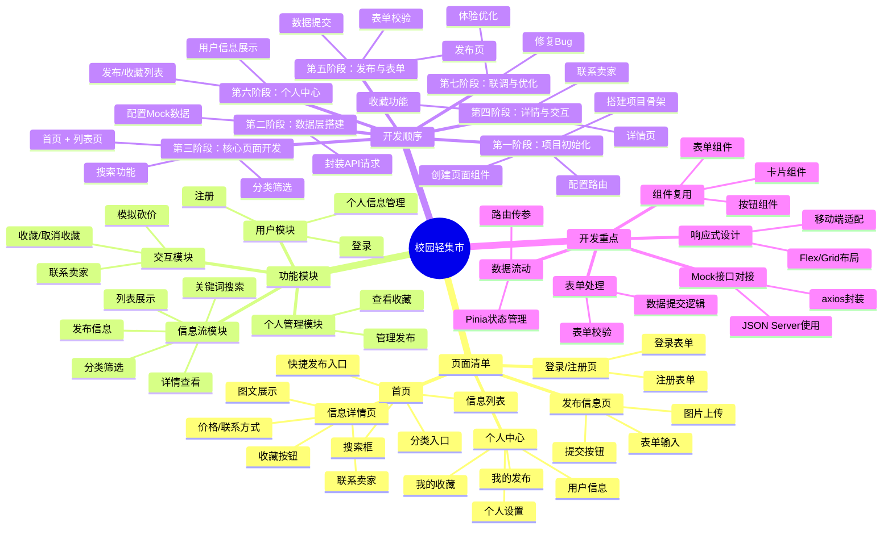

# 校园轻集市 - 项目规划（思维导图）

```mermaid
mindmap
  root((校园轻集市))
    页面清单
      首页
        信息列表
        分类入口
        搜索框
        快捷发布入口
      信息详情页
        图文展示
        价格/联系方式
        收藏按钮
        联系卖家
      发布信息页
        表单输入
        图片上传
        提交按钮
      个人中心
        用户信息
        我的发布
        我的收藏
        个人设置
      登录/注册页
        登录表单
        注册表单
    功能模块
      用户模块
        登录
        注册
        个人信息管理
      信息流模块
        发布信息
        列表展示
        详情查看
        分类筛选
        关键词搜索
      交互模块
        收藏/取消收藏
        联系卖家
        模拟砍价
      个人管理模块
        管理发布
        查看收藏
    开发顺序
      第一阶段：项目初始化
        搭建项目骨架
        配置路由
        创建页面组件
      第二阶段：数据层搭建
        配置Mock数据
        封装API请求
      第三阶段：核心页面开发
        首页 + 列表页
        分类筛选
        搜索功能
      第四阶段：详情与交互
        详情页
        收藏功能
        联系卖家
      第五阶段：发布与表单
        发布页
        表单校验
        数据提交
      第六阶段：个人中心
        用户信息展示
        发布/收藏列表
      第七阶段：联调与优化
        修复Bug
        体验优化
    开发重点
      数据流动
        路由传参
        Pinia状态管理
      Mock接口对接
        axios封装
        JSON Server使用
      表单处理
        表单校验
        数据提交逻辑
      组件复用
        卡片组件
        按钮组件
        表单组件
      响应式设计
        移动端适配
        Flex/Grid布局
```